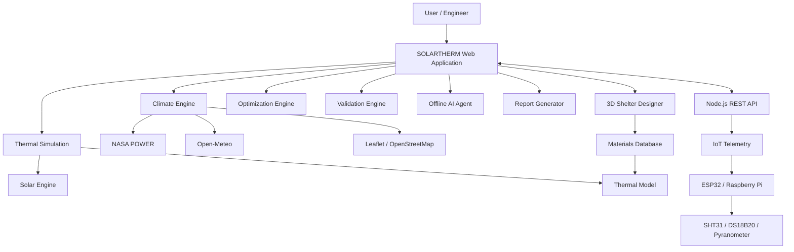

# 🏔️ SOLARTHERM

### Physics-Based Thermal Intelligence Platform for High-Altitude Shelters

[](https://www.sih.gov.in/)
[](#)
[](#license)
[](#)

> **SOLARTHERM** is a physics-based, parametric 3D digital-twin and transient thermal intelligence platform designed to optimize thermal performance of shelters deployed in high-altitude, cold-arid environments such as Ladakh.

---

## 🚀 Overview

SOLARTHERM addresses the challenge of maintaining thermal comfort in temporary and semi-permanent shelters deployed under extreme mountain conditions.

The platform combines:

* ☀️ Solar radiation modelling
* 🌡️ Transient thermal simulation
* 🏠 3D shelter digital twin
* 🧱 Material and glazing selection
* 🔬 Scientific validation
* ⚙️ Parametric optimization
* 🤖 Offline AI advisory
* 📡 IoT telemetry integration
* 🗺️ GIS-based climate analysis
* 📊 Automated engineering reports

The system is designed to support engineering decisions for high-altitude shelters used by defence personnel, disaster-response teams, and civilian communities.

---

## 🎯 Problem Statement

**SIH26051**

> Design and develop an area-specific thermal shelter intelligence platform for high-altitude cold climate environments to optimize passive solar gains, reduce auxiliary heating demand, and ensure thermal comfort for personnel deployed in extreme mountain conditions.

---

## 💡 Proposed Solution

SOLARTHERM provides an integrated engineering workflow:

```text
CLIMATE
   ↓
DESIGN
   ↓
SIMULATE
   ↓
OPTIMIZE
   ↓
VALIDATE
   ↓
REPORT
```

The platform enables engineers to select a location, configure shelter geometry and materials, simulate 24-hour thermal behaviour, compare alternative designs, validate results and generate an engineering report.

---

## ✨ Key Features

### 🗺️ 1. Climate & Site Analysis

Includes six Ladakh research locations:

| Site           | Elevation | Design Winter Temp |
| -------------- | --------: | -----------------: |
| Leh            |   3,505 m |              −22°C |
| Kargil         |   2,676 m |              −18°C |
| Diskit / Nubra |   3,048 m |              −16°C |
| Siachen        |   5,400 m |              −40°C |
| Dras           |   3,280 m |              −35°C |
| Pangong        |   4,350 m |              −28°C |

Uses NASA POWER climatology, Open-Meteo weather data and Leaflet/OpenStreetMap GIS integration.

---

### ☀️ 2. Solar Intelligence Engine

The solar engine calculates:

* Solar elevation
* Solar azimuth
* Solar declination
* Equation of time
* DNI and DHI
* Surface irradiance
* Snow-ground reflection
* South-facing wall solar gain

It incorporates Spencer solar geometry, Erbs GHI decomposition and tilted-surface radiation modelling.

---

### 🌡️ 3. Thermal Simulation

SOLARTHERM uses a transient lumped-capacitance nodal thermal model.

```text
Ceff × dT/dt =
Qsolar + Qinternal
− UA(Tin − Tamb)
− Qinfiltration
− Qstorage
```

Simulation characteristics:

* 5-minute timestep
* 12 sub-steps/hour
* 3 warm-up diurnal cycles
* 24-hour final thermal profile
* Altitude-corrected air density
* PCM latent heat modelling

---

### 🏠 4. 3D Digital Twin

The shelter designer provides an interactive WebGL-based 3D representation using **Three.js**.

Users can configure shelter components and materials while viewing the resulting design in an interactive environment.

---

### 🧱 5. Materials Database

The platform includes thermal properties for materials such as:

* Plain Concrete
* Rammed Earth / Adobe
* PUF Composite Panels
* Granite + XPS
* AAC Blocks
* Timber + Rockwool

It also includes multiple glazing and thermal-storage systems.

---

### ⚙️ 6. Design Optimization

SOLARTHERM evaluates multiple shelter configurations.

The optimization considers:

* Auxiliary heating demand
* Minimum indoor temperature
* Energy savings
* Thermal comfort hours

The optimized configuration can be applied directly to the 3D digital twin.

---

### 🤖 7. Offline AI Advisory Agent

The AI assistant operates without an external API key.

It provides recommendations related to:

* Wall materials
* Solar PV sizing
* Thermal storage
* Glazing
* Comfort hours
* Heating requirements
* Kerosene savings

The agent uses intent-based NLP, physics-based rules and live simulation state.

---

### 📡 8. IoT Telemetry

The Node.js backend provides REST endpoints for field sensor integration.

```text
GET  /api/telemetry
POST /api/telemetry
GET  /api/device
```

Supported sensor types include:

* SHT31 temperature/humidity sensor
* DS18B20 thermal probes
* Pyranometer

The architecture is designed for ESP32/Raspberry Pi field nodes.

---

### 🔬 9. Scientific Validation

SOLARTHERM provides three validation levels:

```text
Tier 1 → Analytical Solution
Tier 2 → Finite Difference Method
Tier 3 → ANSYS APDL Benchmark
```

The system can generate an ANSYS `.mac` script for further engineering validation.

---

## 🏗️ System Architecture



---

## 🛠️ Technology Stack

### Frontend

| Technology         | Purpose                          |
| ------------------ | -------------------------------- |
| HTML5              | Application structure            |
| CSS3               | UI and styling                   |
| JavaScript ES2020+ | Application logic                |
| Three.js           | 3D digital twin                  |
| Chart.js           | Simulation and validation charts |
| Leaflet.js         | GIS mapping                      |

### Backend

| Technology      | Purpose             |
| --------------- | ------------------- |
| Node.js         | Local server        |
| Node.js HTTP    | REST API            |
| File System API | Static file serving |
| In-memory state | IoT telemetry       |

The backend uses Node.js built-in modules and does not require npm dependencies according to the project report.

---

## 📂 Core Modules

```text
SOLARTHERM/
│
├── climate.js
├── solar-engine.js
├── thermal-model.js
├── materials.js
├── optimizer.js
├── shelter3d.js
├── designer-ui.js
├── simulation-ui.js
├── validation.js
├── ai-agent.js
├── weather-forecast.js
├── report.js
├── server.js
│
├── index.html
├── styles/
│
└── assets/
```

---

## ▶️ Running Locally

### Prerequisites

* Node.js
* Modern web browser
* Minimum 4 GB RAM recommended

### Start the server

```bash
node server.js
```

Then open the application in your browser through the local server.

The platform is designed to operate offline and can also be accessed by multiple devices over a local Wi-Fi network.

---

## 📊 Engineering Workflow

```text
┌───────────────────────┐
│ Select Ladakh Site    │
└───────────┬───────────┘
            ↓
┌───────────────────────┐
│ Load Climate Profile  │
└───────────┬───────────┘
            ↓
┌───────────────────────┐
│ Design Shelter        │
│ Geometry + Materials  │
└───────────┬───────────┘
            ↓
┌───────────────────────┐
│ Solar Calculation     │
└───────────┬───────────┘
            ↓
┌───────────────────────┐
│ Thermal Simulation    │
└───────────┬───────────┘
            ↓
┌───────────────────────┐
│ Design Optimization   │
└───────────┬───────────┘
            ↓
┌───────────────────────┐
│ Scientific Validation │
└───────────┬───────────┘
            ↓
┌───────────────────────┐
│ Engineering Report    │
└───────────────────────┘
```

---

## 📈 Reported Performance

The project report presents the following baseline comparison:

| Metric                     | Uninsulated GI Shed | SOLARTHERM Optimized |
| -------------------------- | ------------------: | -------------------: |
| Minimum Indoor Temperature |              ~−15°C |            **+12°C** |
| Auxiliary Heating          |         142 kWh/day |   **~15–20 kWh/day** |
| Kerosene Equivalent        |         ~14.5 L/day |   **~1.5–2.0 L/day** |
| Energy Savings             |                  0% |             **≥85%** |
| Comfort Hours              |                0/24 |        **~20–22/24** |

These figures are project-model outputs and should be field-validated before deployment.

---

## 🌱 Impact

SOLARTHERM aims to contribute to:

* Reduced auxiliary heating demand
* Reduced kerosene consumption
* Improved thermal comfort
* Reduced indoor combustion emissions
* Climate-resilient shelter design
* Evidence-based high-altitude infrastructure planning

The project identifies potential beneficiaries including defence personnel, civilian communities, disaster-response teams, NGOs and infrastructure engineers.

---

## 🔮 Future Development

Planned enhancements include:

* Multi-zone thermal modelling
* PV and electric-heating integration
* AR shelter visualization
* ML-based surrogate optimization
* HVAC/MVHR integration
* Snow-load and seismic analysis
* BIM/IFC export
* Advanced moisture modelling
* OpenFOAM CFD integration

---

## 🧪 Limitations

The current version uses a 1D nodal thermal model and does not provide full CFD airflow simulation or a complete hygrothermal model.

Other identified limitations include:

* Static occupancy schedule
* Isotropic diffuse-solar model
* PCM subcooling not modelled
* Wind-dependent infiltration not modelled
* In-memory telemetry storage

These are identified as areas for future development.

---

## 🏆 Smart India Hackathon

**Problem Statement:** SIH26051
**Project:** SOLARTHERM
**Team:** SOLARTHERM Engineering Team
**Platform Version:** 1.0.0
**Year:** 2026

Developed as a Smart India Hackathon 2026 project focused on thermal intelligence for high-altitude cold-climate shelters.

---

## 📚 References

The project uses established engineering and scientific references including:

* Spencer — Solar position algorithms
* Duffie & Beckman — Solar Engineering
* Erbs et al. — Solar radiation decomposition
* Hay & Davies — Tilted-surface solar radiation
* Liu & Jordan — Solar radiation modelling
* NASA POWER climatology
* LEDeG field data
* CPWD standards
* BIS standards
* ISO 10456
* ASHRAE references

---

## 📄 License

The core SOLARTHERM platform is intended to be released under the **MIT License**.

```text
© 2026 SOLARTHERM Engineering Team
MIT License
```

---

## 👨‍💻 Project Team

**SOLARTHERM Engineering Team**

Built for **Smart India Hackathon 2026 — SIH26051**.

---

<p align="center">
  <b>🏔️ SOLARTHERM</b><br>
  <i>Engineering warmer, safer shelters for extreme environments.</i>
</p>
        
